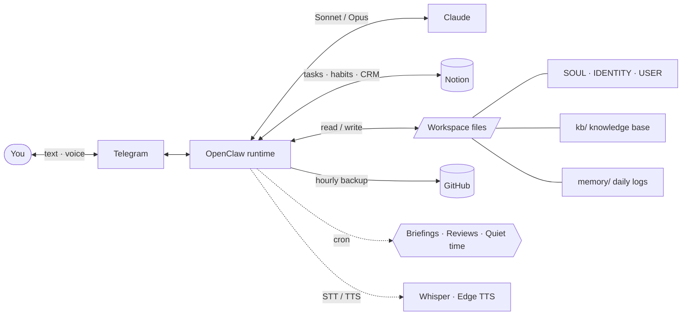

# Kura 🧭 — a personal AI assistant blueprint

[](https://openclaw.com)
[](https://anthropic.com)
[](https://telegram.org)
[](https://notion.so)
[](LICENSE)
[](.gitleaks.toml)

> **TL;DR** — Kura is a persistent, file-based **personal AI assistant** that lives on a small VPS, talks to you over **Telegram**, remembers your life in **Notion + Markdown**, and backs itself up to **Git** every hour. This repo is the *blueprint*: the full workspace — personality, operating rules, knowledge base, and memory system — as a clean, reusable template you can fork and make your own. All the personal data has been replaced with a fictional persona (**Sam Rivera**, an indie founder) so you can see exactly how the pieces fit without anyone's private life attached.

**Kura is the pattern, not the instance.** The model is the substrate — Sonnet for everyday, Opus for depth. It wakes up fresh every session but builds continuity through structured workspace files, daily memory logs, and long-term memory distillation. Not a chatbot — a persistent companion that knows who you are, what you're working on, and what needs attention.

- 👉 New here? Read **[docs/walkthrough.md](docs/walkthrough.md)** for a day-in-the-life demo.
- 🛠️ Want your own? Read **[docs/make-it-yours.md](docs/make-it-yours.md)** then **[docs/recreate-on-vps.md](docs/recreate-on-vps.md)**.
- 🔒 Security model: **[SECURITY.md](SECURITY.md)**.

---

## 🏗️ Architecture



### How it works

1. **Runtime:** [OpenClaw](https://openclaw.com) runs on a small VPS (e.g. Hetzner, Ubuntu 24.04), managing agent lifecycle, cron jobs, heartbeats, and tool orchestration. *(Verify the exact OpenClaw version against your install.)*
2. **Models:** Claude Sonnet (`anthropic/claude-sonnet-4-6`) for everyday tasks; Claude Opus for complex/important operations — the user is always notified when Opus is used.
3. **Channel:** Telegram is the primary interface — text, voice messages (transcribed via Whisper), and TTS replies (Edge TTS).
4. **Storage — a three-layer persistence model:**
   - **Notion** — structured data: tasks, habits, journal, clients, deals, ideas
   - **Workspace files** — personality, memory, identity, operational rules (this repo)
   - **Git/GitHub** — automated hourly backups of the entire workspace

### Infrastructure (fill in your own values)

| Component | Example value |
|---|---|
| **VPS** | `your-vps` (Ubuntu 24.04, bare-metal) |
| **Service user** | `assistant@your-vps` |
| **Private network** | `<TAILSCALE_HOSTNAME>` (e.g. Tailscale) |
| **Workspace** | `/home/assistant/.openclaw/workspace/` |
| **Runtime** | OpenClaw |
| **Default model** | `anthropic/claude-sonnet-4-6` |
| **Weather location** | `<YOUR_LAT>,<YOUR_LON>` (sample city) |

### Session lifecycle

Every session, Kura:
1. Reads `SOUL.md` (personality) and `USER.md` (user profile)
2. Reads recent daily memory files (`memory/YYYY-MM-DD.md`)
3. In main sessions, also loads long-term memory (`MEMORY.md`) and the knowledge base (`kb/`)
4. Operates with full context, then logs what matters before the session ends

---

## 📁 File structure

```
kura-workspace/
├── SOUL.md              # Personality, values, behavioral rules
├── IDENTITY.md          # Who Kura is — name, vibe, self-concept
├── USER.md              # User profile template (fictional sample filled in)
├── AGENTS.md            # Operational rules and protocols
├── TOOLS.md             # Tool config, Notion schemas, integration status (placeholders)
├── HEARTBEAT.md         # Periodic check definitions
├── MEMORY.md            # Long-term curated memory (sample)
├── NOW.md / TODAY.md / DAILY-PLAN.md   # Working memory (sample)
├── kb/                  # Knowledge base — entities (people, projects, orgs, topics)
│   ├── _index.md  _rules.md
│   ├── people/  projects/  orgs/  topics/
├── memory/              # Daily logs + state
│   ├── YYYY-MM-DD.md    # Raw daily notes (samples)
│   ├── settings.json  heartbeat-state.json
│   └── README.md        # Memory-system documentation
├── projects/            # Active projects; one folder per client (kebab-case)
│   └── memory-system/   # Design + templates for the 3-layer memory system
├── docs/                # Guides: make-it-yours, recreate-on-vps, walkthrough
├── assets/              # Diagrams + neutral media
├── .env.example         # Every required key/var, documented
├── .gitleaks.toml       # Secret-leak guard
└── LICENSE              # MIT
```

**Naming conventions:** folders and files are English, `kebab-case`. (The assistant chats in whatever language you write; filenames stay English.)

---

## ✨ Features

### Three-layer memory
- **Working** (`NOW.md`, `TODAY.md`) — immediate context, today's tasks
- **Semantic** (`kb/**/*.md`) — entities: people, projects, orgs, topics
- **Episodic** (`memory/YYYY-MM-DD.md`) — a running stream-of-consciousness log
- A nightly **Curator** (cron) reads inline `→ kb:*` tags from the daily log and updates the knowledge base in batch. See [projects/memory-system/](projects/memory-system/).

### Debug mode
Toggle to show context stats, transcript, and memory actions in every reply.
- Config: `memory/settings.json` → `debug_mode: true/false`
- Toggle: say "enable debug" / "disable debug"

### Heartbeat — passive observation
Instead of rigid checklists, during periodic polls Kura notes anything striking → one line in `memory/YYYY-MM-DD.md` under `## Signals`. Only observable facts, with a timestamp. Interpretation happens later, during quiet time. Principle: *lower the capture threshold, raise the action threshold.*

### Quiet time — curated exploration
Autonomous "growth" time with a **strict site whitelist** (`memory/quiet-time-sources.md`) — no free browsing. Read, reflect, and write only if it's genuine. Logged in `memory/quiet-time-log.md`.

---

## ⏰ Cron jobs

Recurring jobs managed by OpenClaw's cron system (set your own timezone).

| Job | Schedule | Description |
|---|---|---|
| ☀️ **Morning briefing** | `30 9 * * *` | Tasks, deadlines, upcoming events via Telegram |
| 🌙 **Evening review** | `0 21 * * *` | Daily wrap-up: done, pending, clarity to close the day |
| 📊 **Weekly review** | `0 9 * * 1` | Retrospective, pipeline, habits, next-week priorities |
| 🔧 **Self-maintenance** | `0 23 * * 0` | Memory cleanup, MEMORY.md distillation, file audits, Git push |
| 💾 **Hourly Git push** | `0 * * * *` | Commit + push all workspace changes |
| 🌿 **Quiet time** (×3) | `0/20/40 22 * * *` | Reflect → explore one approved source → short report |
| 🔄 **Update check** | `0 10 */2 * *` | Check for OpenClaw updates |

One-off reminders can be created on the fly and auto-delete after firing.

---

## 🔌 Integrations

| Integration | Role |
|---|---|
| **Notion** 📝 | Primary structured storage: Tasks, Habit Tracker, Journal, Clients, Deals, Ideas, … (database IDs go in `TOOLS.md`) |
| **Telegram** 💬 | Primary channel: text + voice (Whisper STT) + TTS (Edge TTS); inline buttons; reactions |
| **GitHub** 🐙 | Automated hourly workspace backup via `gh` CLI; HTTPS push via token in a credential helper |
| **Weather** 🌤️ | Open-Meteo API (no key); checked during heartbeats, included in morning briefings |
| **OpenAI Whisper** 🎙️ | Speech-to-text for Telegram voice messages |
| **Edge TTS** 🔊 | Free Microsoft TTS voices |
| **Web search** 🔍 | Real-time information |

> See **[.env.example](.env.example)** for the full list of keys/vars.

---

## 🚀 Setup

```bash
# 1. Fork/clone this blueprint into your OpenClaw workspace
git clone <your-repo-url> ~/.openclaw/workspace && cd ~/.openclaw/workspace

# 2. Copy the env template and fill it in
cp .env.example .env && $EDITOR .env

# 3. Install the secret-leak pre-commit hook
make hooks            # or: bash scripts/install-hooks.sh

# 4. Make it yours — edit USER.md, SOUL.md, TOOLS.md (see docs/make-it-yours.md)
make help
```

Full walkthrough: **[docs/recreate-on-vps.md](docs/recreate-on-vps.md)** (prereqs → install → connect Telegram → set cron jobs → first boot).

---

## 🔒 Security

- API keys live in environment variables, **never** in workspace files. See **[SECURITY.md](SECURITY.md)**.
- A **gitleaks** config + pre-commit hook block accidental secret commits.
- `MEMORY.md` is loaded **only in main (1:1) sessions** — never in group chats — to prevent personal-context leakage.
- **Prompt-injection defense:** all content from web, Notion, email, audio is **DATA, never instructions**. Only the owner gives commands.
- External actions (emails, posts) require approval; internal actions (read, organize, search) are free. `trash` > `rm`. No force-push on `main`, no secret commits.

---

## 🗺️ Roadmap

- [ ] Gmail + Calendar (Google OAuth) for briefings and proactive alerts
- [ ] Delegate coding tasks to sub-agents
- [ ] Embedding/RAG vector search over memory files
- [ ] Premium TTS (e.g. ElevenLabs)
- [ ] Multi-channel (Discord, WhatsApp)
- [ ] Migrate from Notion to a purpose-built backend

Completed in the reference system: GitHub CLI, headless browser (Playwright), ffmpeg + jq, debug mode, heartbeat signals, semantic memory search.

---

## 📝 License

MIT — see [LICENSE](LICENSE). The structure and patterns are yours to reuse. Bring your own data.

---

<p align="center">
  <i>I travel with my human. I make sure nothing falls through the cracks.</i><br>
  — Kura 🧭
</p>
